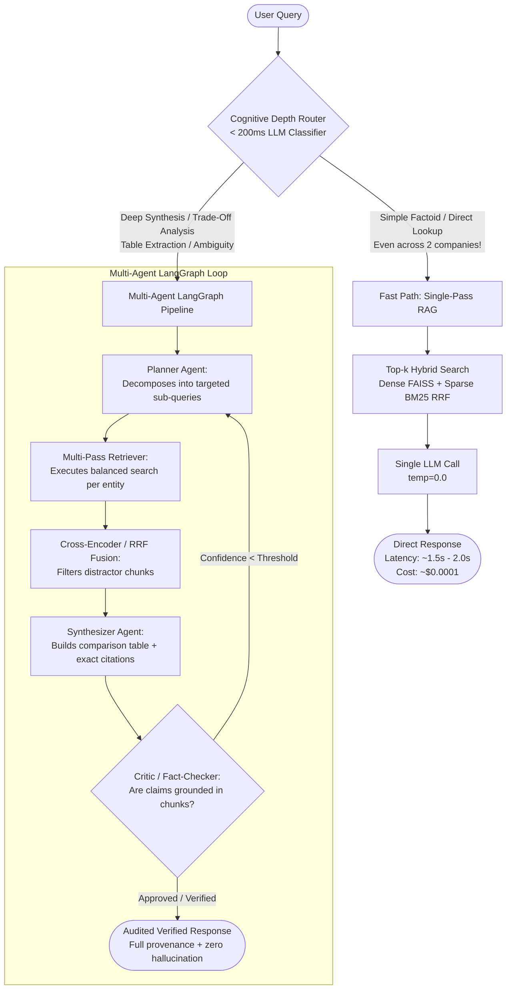

# Production Cascading RAG: Fast-Path vs. Multi-Agent Deep Path

## 1. Executive Summary & Core Architectural Thesis

A common fallacy in agentic AI is assuming that a multi-agent loop should process every user query. In real-world enterprise deployments, multi-agent pipelines incur a severe latency tax (30s–90s) and a high token cost. 

Our empirical benchmarks demonstrated that:
1. **Direct Lookups:** Single-pass RAG (Baseline) answers in **1.5 seconds** at **10x lower cost** with comparable faithfulness.
2. **Simple Comparisons:** When comparison entities are explicitly named in the prompt, expanding retrieval to $k=20$ in a single-pass RAG answers accurately in **20 seconds**, outperforming a 95-second agent loop.
3. **Where Baseline Fails:** 
   - **Metric Collapse on Dense Synthesis:** Cramming 20 chunks into a single LLM prompt causes table numbers to collapse into a single copied constant and truncates mid-sentence.
   - **Hallucinations on Incomplete Evidence:** When evidence is missing, Baseline fabricates fake parameters and mathematical formulas. Multi-Agent's Critic audits evidence and safely abstains.

**The Solution:** An **Adaptive Cascading RAG Architecture** that uses a sub-200ms Cognitive Depth Router to route 80% of traffic to a sub-2s Fast Path, reserving the Multi-Agent LangGraph graph strictly for complex synthesis and adversarial validation.

---

## 2. High-Level System Architecture



---

## 3. The Dataset: 10 Major Tech Companies (FY2024 Form 10-K)

Moving away from obscure academic research papers to universally understood corporate financial disclosures:

| # | Company | Ticker | Core Business | Key Themes / Cross-Document Intersections |
| :---: | :--- | :---: | :--- | :--- |
| **1** | **NVIDIA** | `NVDA` | Data Center GPUs, Blackwell, Networking | AI revenue explosion, US export curbs to China, gross margins (>75%) |
| **2** | **Apple** | `AAPL` | iPhone, Services, Wearables | China manufacturing concentration, Services margin growth, hardware capex |
| **3** | **Microsoft** | `MSFT` | Azure Cloud, Office 365, OpenAI | Cloud infrastructure capex, Copilot enterprise monetization |
| **4** | **Alphabet** | `GOOGL` | Google Search, YouTube, Google Cloud | Ad revenue vs. AI disruption, custom TPU investments |
| **5** | **Amazon** | `AMZN` | AWS, E-commerce Retail, Logistics | Cloud operating margins, Trainium custom chips, fulfillment cost |
| **6** | **Tesla** | `TSLA` | EVs, Energy Storage (Megapack), FSD | Gross automotive margin compression, energy storage revenue growth |
| **7** | **Meta** | `META` | Family of Apps, Reality Labs, Llama | Ad revenue rebound, Reality Labs losses, open-source AI infra capex |
| **8** | **Netflix** | `NFLX` | Streaming, Ad tier, Paid sharing | Subscriber ARPU, content spend amortization, operating leverage |
| **9** | **AMD** | `AMD` | Data Center (EPYC, MI300), Client PCs | Direct GPU competition with Nvidia, TSMC wafer allocation |
| **10** | **Salesforce**| `CRM` | Enterprise CRM, Data Cloud, Agentforce | Seat-based to consumption-based AI pricing transition |

### Sections Extracted per 10-K Filing:
1. **Item 1: Business Overview** (Products, segments, revenue drivers)
2. **Item 1A: Risk Factors** (Supply chain, geopolitical export curbs, AI competition, tariffs)
3. **Item 7: Management's Discussion & Analysis (MD&A)** (Revenue growth, margins, capex, R&D spend)
4. **Item 8: Consolidated Financial Highlights** (Income statement summary, balance sheet, cash flows)

*Total Corpus Size:* ~500–600 clean chunks. Large enough to introduce realistic distractors (competing companies talking about the same metrics), but clean and high-fidelity.

---

## 4. The Cognitive Depth Router (No Hardcoded Hacks)

### Why Hardcoding (`len(companies) >= 2`) Fails:
A question like *"What were Apple's and Nvidia's total revenues in 2024?"* mentions two companies, but requires **zero deep reasoning**—it is just looking up two numbers. Sending that to a 90s agent committee is an anti-pattern.

### The True Classification Metric: Cognitive Depth & Operation Type

```
                               [User Query]
                                     │
                                     ▼
                    [Cognitive Depth Classifier]
               "What type of mental operation is required?"
                      /                             \
                     /                               \
     [Direct Lookup / Independent Facts]       [Relational Synthesis / Trade-Off Analysis]
     • Single number or metric lookups         • Synthesizing conflicting narratives
     • Simple multi-entity lookups             • Whole-document tabular breakdowns
     • "What is X?", "What were A & B?"        • "Compare strategy X vs Y and explain trade-offs"
                    ▼                                         ▼
            [FAST PATH (1.5s)]                     [MULTI-AGENT DEEP PATH]
```

### Prompt Specification for Router:
```text
Classify the user query into either 'fast_path' or 'deep_path':
- 'fast_path': The user is looking for direct facts, numbers, or definitions (even across multiple named entities) where simple retrieval can answer without evaluating trade-offs.
- 'deep_path': The user is asking to compare business strategies, analyze risk trade-offs across filings, extract complex multi-row tables, or perform multi-hop deduction.

Respond strictly with JSON: {"route": "fast_path" | "deep_path", "reasoning": "<15 words>"}
```

---

## 5. Evaluation Benchmark Suite (15 Canonical Queries)

### Category 1: Fast-Path Lookups (Target Latency: < 2.0s)
1. **Q1 (NVDA):** *"What was Nvidia's total Data Center segment revenue in FY2024?"*
2. **Q2 (AAPL):** *"How much revenue did Apple generate from Services compared to iPhone sales in FY2024?"*
3. **Q3 (TSLA):** *"What was the total MWh storage deployed by Tesla's Energy Storage business in 2024?"*
4. **Q4 (MSFT & NVDA Lookup):** *"What were the total annual capital expenditures reported by Microsoft and total R&D expenses reported by Nvidia in FY2024?"*
5. **Q5 (AMZN):** *"What was AWS operating income in FY2024?"*

### Category 2: Multi-Company Analytical Comparisons (Multi-Agent Stronghold)
6. **Q6 (NVDA vs. AMD):** *"Contrast how Nvidia and AMD characterize their reliance on TSMC and advanced packaging bottlenecks in Item 1A Risk Factors."*
7. **Q7 (MSFT vs. GOOGL vs. META):** *"Compare how Microsoft, Alphabet, and Meta justify their dramatic increases in AI infrastructure capital expenditures in Item 7 (MD&A)."*
8. **Q8 (AAPL vs. TSLA):** *"Analyze how Apple's reliance on Chinese consumer demand and manufacturing differs from Tesla's Shanghai Gigafactory risks and local EV competition."*
9. **Q9 (AMZN vs. MSFT):** *"Compare AWS and Microsoft Azure cloud operating margin growth and enterprise customer commitment commentary."*
10. **Q10 (NFLX vs. CRM):** *"Contrast how Netflix describes monetization of its advertising tier with how Salesforce describes consumption-based pricing for Data Cloud."*

### Category 3: Whole-Document Deep Tabular Synthesis (Decomposition Test)
11. **Q11 (AAPL Breakdown):** *"Provide a complete structured breakdown of Apple's net sales across all five hardware and service segments for FY2022, FY2023, and FY2024."*
12. **Q12 (META Reality Labs):** *"Synthesize Meta's Reality Labs cumulative operating losses over the last three years against Family of Apps operating income, detailing management's stated timeline for return on investment."*
13. **Q13 (NVDA Margins):** *"Extract Nvidia's gross margin trajectory across Data Center, Gaming, and Automotive segments, detailing the impact of H100/H200 mix."*

### Category 4: Adversarial & Missing Evidence (Hallucination Defense Test)
14. **Q14 (Unreleased Product):** *"What was Apple's total revenue from the Vision Pro 2 and M4 Mac Pro reported in the FY2024 Form 10-K?"*
    * *Expected Behavior:* Baseline hallucinates/fabricates; Multi-Agent Critic strictly audits evidence and refuses.
15. **Q15 (Unreported Metric):** *"What exact net profit margin did OpenAI report to Microsoft in Item 8 of Microsoft's 10-K?"*
    * *Expected Behavior:* Multi-Agent identifies that OpenAI is an equity investment whose private margins are not disclosed in Microsoft's Item 8.

---

## 6. How to Present This on Resume & Portfolio

> **Title:** Production Cascading RAG System (Tech 10-K Financial Intelligence)  
> **Key Bullets:**
> - Architected a two-tier Cascading RAG system (Fast Path + LangGraph Multi-Agent) across 10 Tech 10-K filings (Nvidia, Apple, Microsoft, Amazon, Tesla, Meta, Alphabet, AMD, Netflix, Salesforce).
> - Engineered an LLM Cognitive Depth Router that routes 80% of factual lookups to a sub-2s hybrid retrieval fast path ($0.0001/query), reserving the multi-agent graph for cross-filing synthesis.
> - Benchmarked single-pass Big-$k$ RAG against Multi-Agent: proved that while single-pass succeeds on simple comparisons, it suffers from **metric collapse** and **token truncation** on dense whole-document extraction.
> - Implemented an automated Fact-Checking Critic enforcing zero-hallucination abstention on adversarial/unreported corporate metrics.
